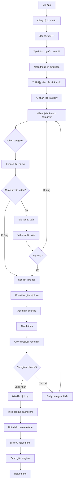
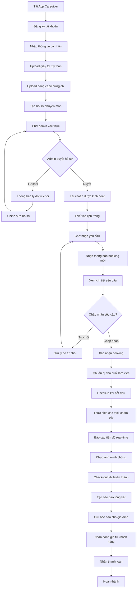
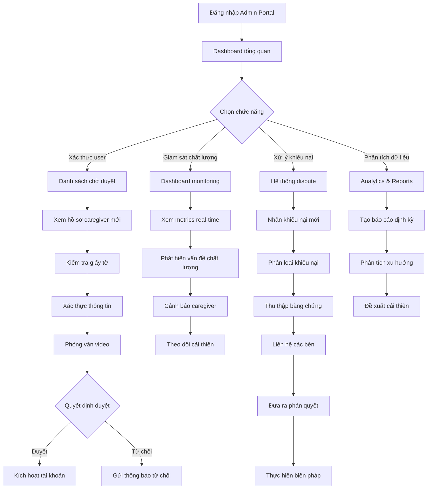
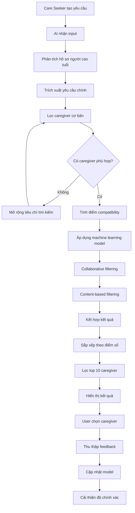
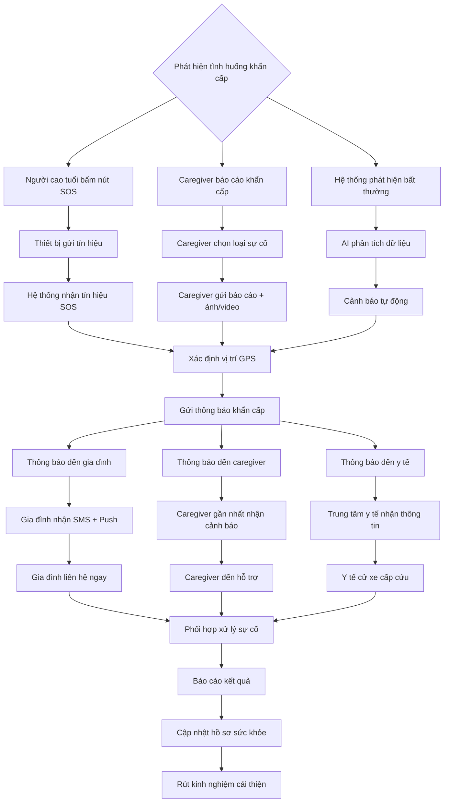
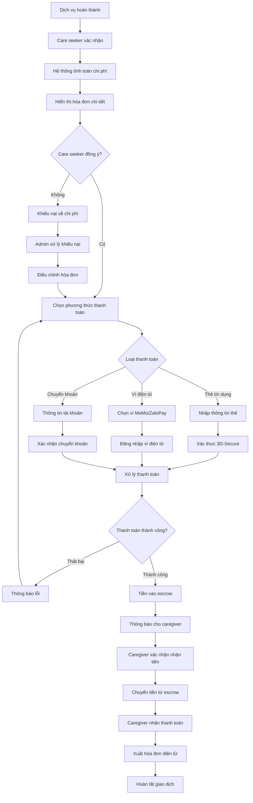
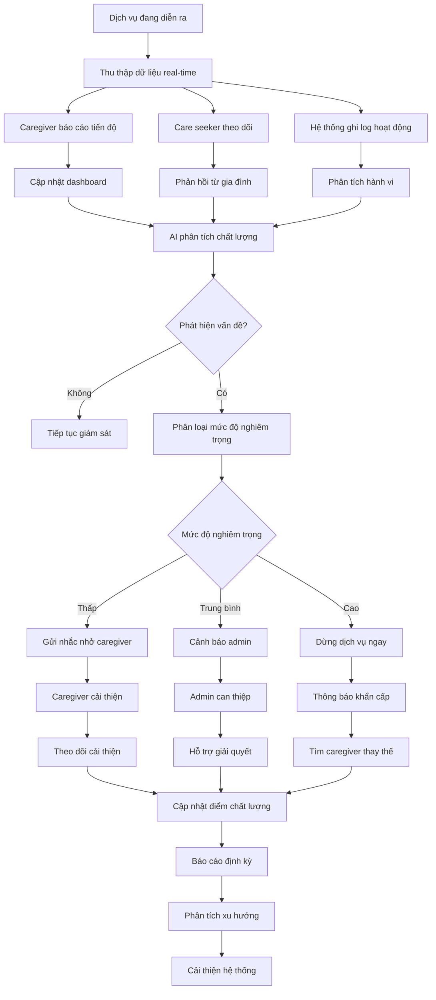
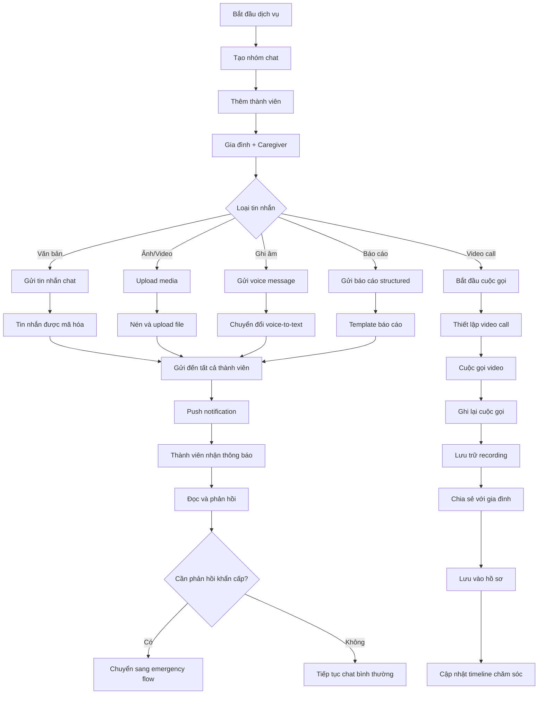

# CÁC FLOW DIAGRAM CHI TIẾT - HỆ THỐNG CHĂM SÓC NGƯỜI CAO TUỔI

## FLOW 1: CARE SEEKER - TÌM VÀ THUÊ CAREGIVER

## FLOW 2: CAREGIVER - ĐĂNG KÝ VÀ NHẬN VIỆC

## FLOW 3: ADMIN - QUẢN LÝ VÀ GIÁM SÁT

## FLOW 4: AI MATCHING SYSTEM

## FLOW 5: EMERGENCY ALERT SYSTEM

## FLOW 6: PAYMENT PROCESSING

## FLOW 7: QUALITY MONITORING

## FLOW 8: COMMUNICATION SYSTEM

Các flow diagram này mô tả chi tiết cách thức hoạt động của từng tính năng trong hệ thống, giúp bạn hiểu rõ quy trình và luồng xử lý của ứng dụng chăm sóc người cao tuổi.